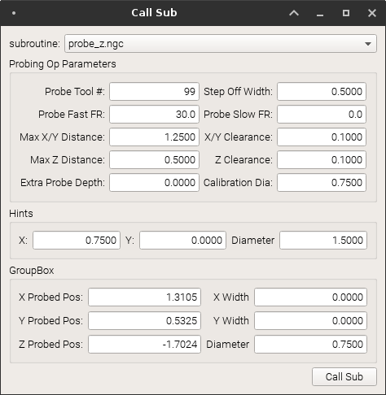

# TurboProbe

Very minimal UI for calling subroutines in LinuxCNC



## Configuring

### Machine INI File

Add subroutine path to the [RS274NGC] section  

```
[RS274NGC]

SUBROUTINE_PATH = path/to/subroutines
```

### Configuring Sub caller

In the `tuboprobe.py` file you need to change the `SUBROUTINE_PATH` variable
to point to the subroutine directory defined in your machines INI.


## Dependencies

`sudo apt-get install python-pyqt5`  


## Usage

Make sure LinuxCNC is running, and if you are running a RIP set up the environment.
Then launch the sub caller UI:

`python tuboprobe.py`  


Select the subroutine you want to call from the combobox and enter and args
in the input boxes. If you leave a box empty that arg will be skipped.
